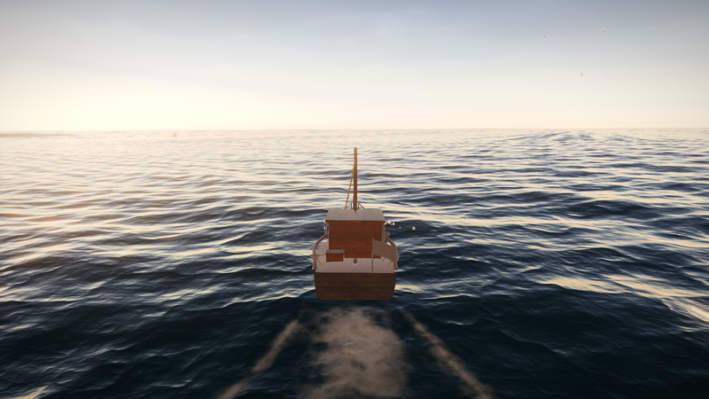
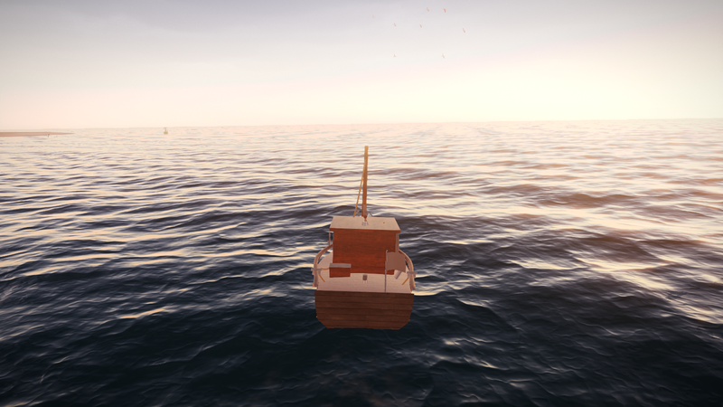
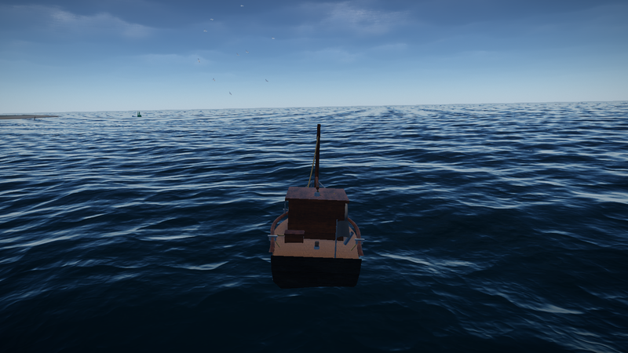
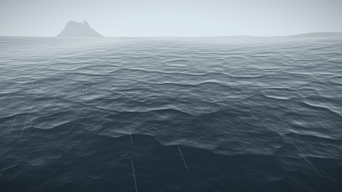

# Endless Fishing

An endless ocean, under the sky that is actually above you right now.

**[Play it →](https://winchxyz.github.io/endless-fishing/)**



| Dawn — sun +1° | Noon — sun +81° |
|---|---|
|  |  |
| **Civil twilight — sun −8°** | **Moonless night — sun −34°** |
|  |  |
| **Overcast, force 5** | **Storm, force 9** |
|  |  |



Every one of those is the same code at a different UTC timestamp. There is no day/night curve and
no weather preset: the sky comes out of the ephemeris and the sea state out of a pressure field.
`npx tsx scripts/media.ts` regenerates the lot, so the pictures cannot drift from the renderer.

---

## What it is

You pilot a small workboat across an open sea and you fish. That is the whole loop. Everything
else is an argument that a simple loop is worth playing if the world around it is real.

The sky is not a day/night cycle. It is an astronomical simulation driven by your machine's
clock and your actual location. If you look up at 22:41, the constellations are where they are
outside your window, the moon is the right phase, and its crescent tips the way the real one
does. There is no hand-authored time-of-day curve anywhere in the repository.

## Controls

| | |
|---|---|
| `W` / `S` | Throttle |
| `A` / `D` | Rudder |
| `Shift` | Boost |
| `Space` | Anchor — steadies the boat for fishing |
| Hold **LMB** | Charge a cast; release to throw |
| `R` / **LMB** | Reel |
| `C` | Cycle camera: follow, first person, orbit |
| `J` | Species journal |
| `Esc` | Settings — graphics, time scale, date override, location |
| `` ` `` | Developer panel: FPS, draw calls, `renderer.info` |

## The technical part

### Astronomy

`src/astro/` is pure — no three.js, no DOM, and it is where 52 of the tests live.

- **Sun**: the NOAA algorithm (Meeus ch. 25) — geometric mean longitude, equation of centre,
  apparent longitude, obliquity, hour angle. Better than 0.01° against VSOP87.
- **Moon**: truncated ELP-2000/82, the full 60-term longitude/distance and 60-term latitude
  tables from Meeus ch. 47, plus topocentric parallax, the position angle of the bright limb,
  and optical libration (ch. 53). The disc is shaded by the true sub-solar direction over the
  NASA LROC albedo map with relief from LOLA elevation, with **Lommel-Seeliger** rather than
  Lambert — regolith backscatters, which is why a full moon reads as a flat bright disc and not
  as a shaded ball.
- **Refraction**: Bennett *and* Sæmundsson, used in opposite directions. They differ by 5.5′ at
  the horizon, which is three minutes of sunset.
- **Stars**: 8404 from the Yale Bright Star Catalogue to magnitude 6.5, in one draw call, with
  real magnitudes and B−V colours through the Planckian locus.

**Verified against the US Naval Observatory.** Every rise, set, transit and twilight event
matches *to the minute* at Tel Aviv and at Reykjavík on the winter solstice. Reproduce it:

```bash
npx tsx scripts/almanac-check.ts 2026-07-30 32.08 34.78 3
```

### Ocean

Waves are importance-sampled from a **JONSWAP spectrum** parameterised by wind speed and fetch,
with a directional spreading exponent tied to the Beaufort force. Nothing is hand-tuned;
significant wave height and peak period are *read off* the resulting bank.

`math/Gerstner.ts` and `shaders/lib/gerstner.glsl` are hand-mirrored, and a unit test could only
compare the TypeScript against itself — so `npm run verify` renders the displacement for 4096
points on the GPU, reads it back, and compares. **Measured agreement: 0.0059 mm.** The build
fails above 1 mm, because a boat that floats through the wave it appears to be riding is the one
failure that cannot be argued with.

The whole sea, from a metre away to eighteen kilometres out, is **one draw call**.

### Sky

Hillaire's LUT atmosphere with ozone absorption and multiple scattering. Ozone is what makes the
zenith deep blue at twilight instead of muddy brown; multiple scattering is what fills the
shadows on an overcast day. Earth's shadow and the Belt of Venus are not drawn and not
special-cased — they emerge from the integral.

Eighteen CC0 sky panoramas are indexed by weather and sun altitude, and each one's **baked sun
position is derived** from its shooting coordinates and timestamp by the same NOAA solver that
drives the live sun — so the panorama can be rotated to put its highlight exactly on the
analytic disc. Each is divided by its own mean luminance and *modulates* the analytic sky rather
than replacing it, so absolute level and twilight colour stay physical while the clouds come
from a photograph of real clouds.

Measured at solar noon: **2784 cd/m² at the zenith, 8424 at the horizon.** Real values.

### Weather

A synoptic model, not a state machine on a timer. Sea-level pressure is 3D fBm advected by a
steering flow; wind is the geostrophic response `V = ∇p/(ρf)` rotated along the isobars, with
the Coriolis parameter from the real latitude. The eight weather states are a *classification of*
that field. Clear cannot become storm without clouding over first — not because a rule forbids
it, but because every quantity is exponentially damped and a damped wind cannot skip force 5.

### The wake

A ribbon of geometry skinned along the boat's own track, carrying both of Kelvin's wave systems.
The transverse crests are square across the track at a wavelength of exactly 2πv²/g, so they open
out as the throttle goes on; the diverging pair are confined inside a half-angle of arcsin(1/3) =
19.47°, which has no speed in it at all — that is why every wake on earth, from a duck to a
supertanker, opens at the same angle. The ribbon sits on the sea by evaluating the *same* Gerstner
bank the ocean's own vertex shader evaluates, from the same uniform arrays and the same clock, so
it can never float above a swell or cut through one. Bow spray is a GPU particle system: the CPU
sets an emission level and an emitter transform once a frame and every droplet's arc is
closed-form in the vertex shader, with emission going as the *cube* of speed plus a term for the
hull's vertical acceleration, because a boat landing off a crest throws far more water than a boat
cruising.

### Sound

Every bed is synthesised, and every one is driven by a number out of `WorldState` rather than by a
trigger. The sea is noise shaped by significant wave height, with the hiss of breaking crests
appearing only above force 4 — because whitecaps do. Wind in the rigging is a *tone*, not a hiss:
a wire sheds vortices at `f = St·U/d`, so the note rises as it breezes up. The engine is an FM
voice at the firing frequency with governor droop, so opening the throttle under way sounds
different from revving in neutral. Thunder is delayed by the real distance at 343 m/s and filtered
by it too — a strike at 400 m is a crack, one at 8 km is four seconds of low rumble with no crack
left in it.

### Buoyancy

Ten probes, Archimedes, hand-written, no physics library, integrated at a fixed 120 Hz. Building
it surfaced two real defects that were corrected analytically rather than tuned around: the
probe quadrature was losing two thirds of the hull's righting moment, and buoyancy acting at the
keel rather than at the prism centroid trimmed the hull 7° down by the head.

## Build

```bash
npm install
npm run assets      # 131 MB of CC0 assets, checksum-locked, idempotent
npm run textures    # ORM packing, lunar normal map, star catalogue → binary
npm run test:run    # 199 tests
npm run dev
```

`scripts/probe.ts` boots headless, captures as many moments as you ask for inside one browser
session, prints the photometry, the helm and the frame stats for each, and writes both the frame
and a 4× zoom of its horizon:

```bash
npx tsx scripts/probe.ts --times=2026-06-21T16:10:00Z,2026-06-21T21:30:00Z --tag=look
npx tsx scripts/probe.ts --hold=w --settle=40000 --tag=wake     # under way, for the wake
npx tsx scripts/probe.ts --graphics='{"bloomEnabled":false}'    # one effect at a time
```

That last form is how the horizon bug was finally caught: capture the same moment with one knob
off and diff the rows either side of the horizon.

## Performance

Measured on an RTX 4070 Laptop at 1080p, High preset: **60 FPS, 157 draw calls** against a budget
of 300, 900k triangles, 41 shader programs. The triangle count went up by 400k when the ocean was
extended past the horizon — see `HORIZON_REACH_M` in `world/Ocean.ts` and the curvature term at
the end of `ocean.vert`, which together are what removed the band that used to sit on the horizon
of every frame.

## Credits

Every downloaded asset is CC0 or public domain and is credited individually in
`assets/CREDITS.md`, regenerated from the manifest on every fetch. Sky panoramas and PBR
materials from [Poly Haven](https://polyhaven.com) and [ambientCG](https://ambientcg.com); lunar
albedo and elevation from [NASA GSFC SVS](https://svs.gsfc.nasa.gov/4720); the Yale Bright Star
Catalogue via the Astronomical Data Center.

**All geometry — boat, fish, islands, trees, props — is authored procedurally in code**, not
downloaded. Textures are real; geometry is ours.

Code is MIT. See `LICENSE`.

## Known issues

Recorded honestly in `PROGRESS.md`. The current ones: there is no depth of field, no ground-truth
ambient occlusion, no god rays and no motion blur — each is a convolution effect needing a
full-screen pass of its own, and CLAUDE.md's degradation priority lists the first and the last as
things to *cut* before shadow cascades, so none of them was worth adding ahead of the grade. In
dev builds the console carries one advisory note from the graphics driver about three's own PMREM
prefilter shader; it is reported separately by `npm run verify` and there is no edit to this
repository that removes it.
